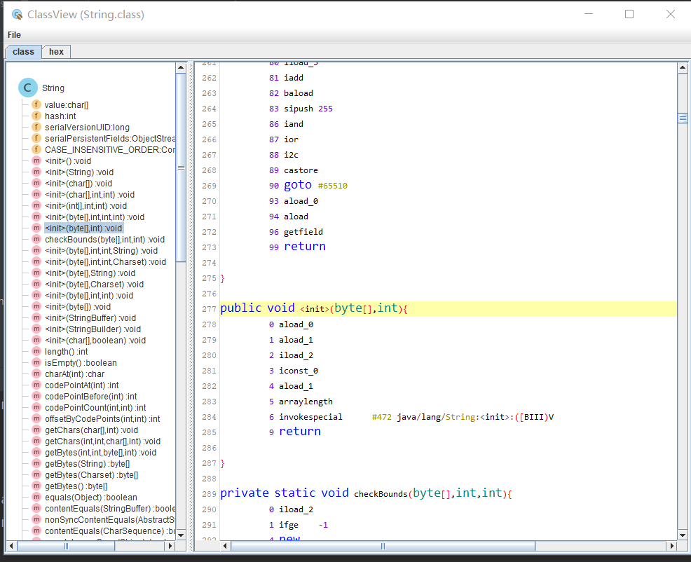
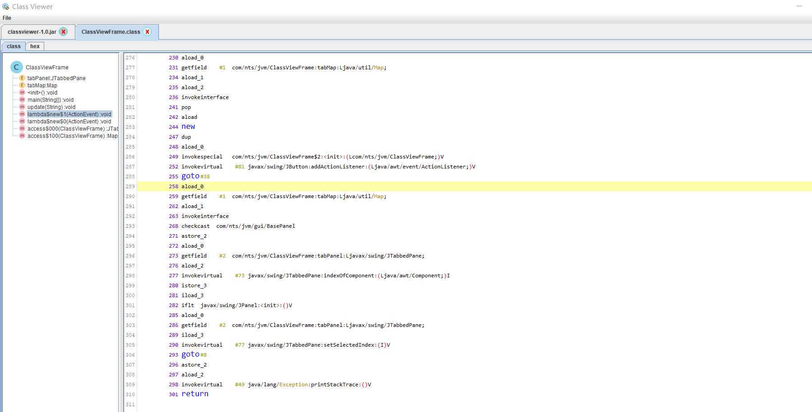

# java-classViewer


java-classViewer v1 is a lightweight Java class file viewer only depends on JDK and JFC SWING, it only has a single jar file  , it can work on JRE 6.


## Features

* Understands class files
* Displays parsed class file as tree and hex text
* The corresponding hex text is highlighted when you select a tree node

## Build

Building java-ClassViewer  requires Java 8

```shell
mvn clean package -Dmaven.test.skip=true
```

## Run
```shell
jave -jar  java-classviewer-v1.0-jar-with-dependencies.jar
```

## Screenshots

## view class



## view hex code


## view jar file





## document

https://docs.oracle.com/javase/specs/jvms/se16/html/jvms-6.html

## about us


 