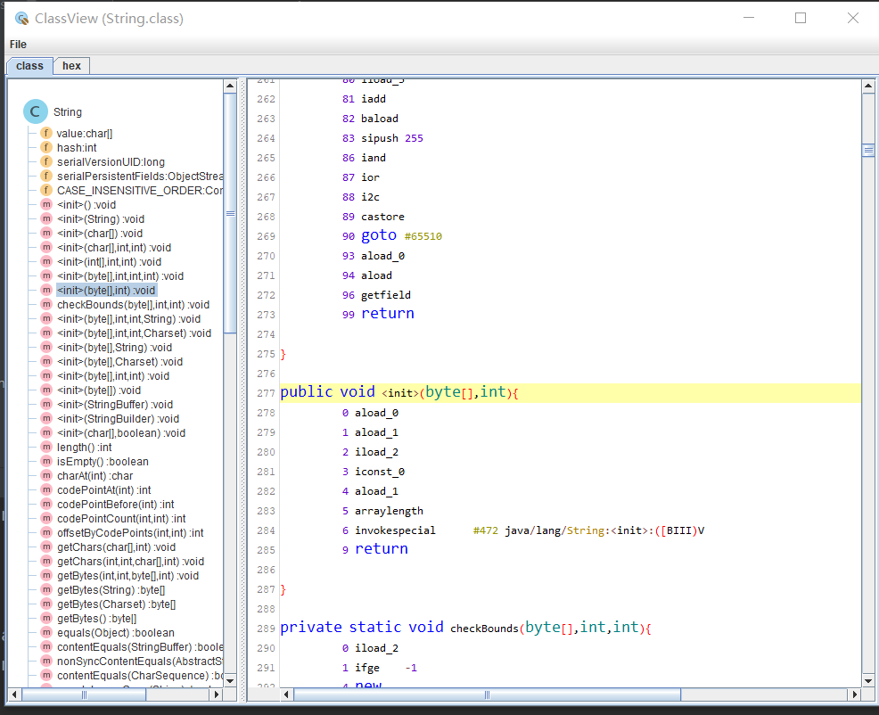
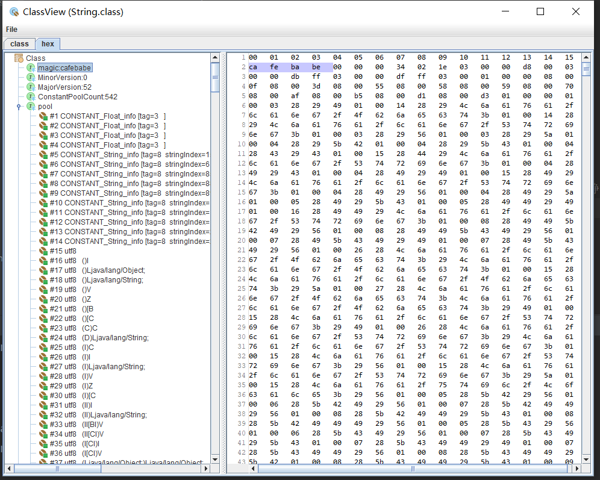
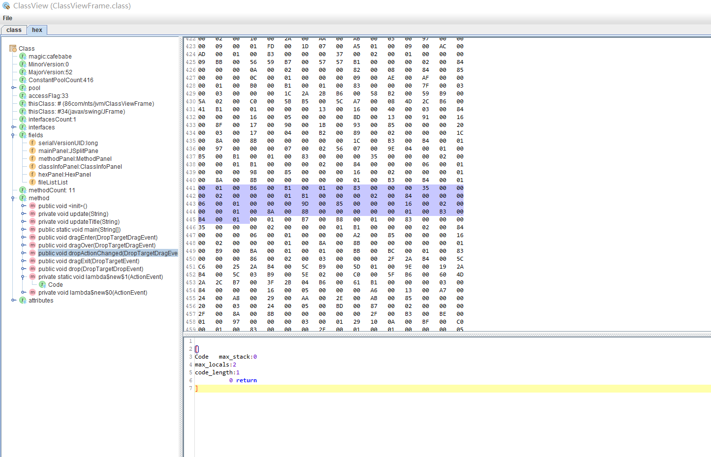
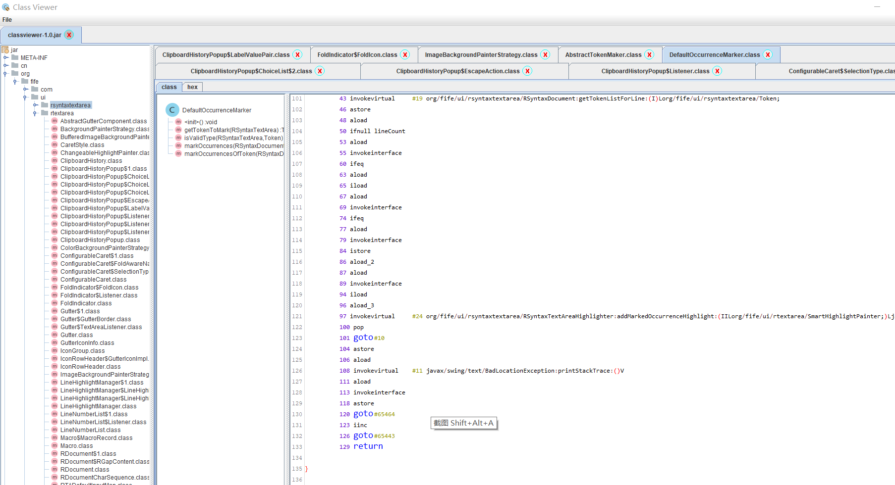
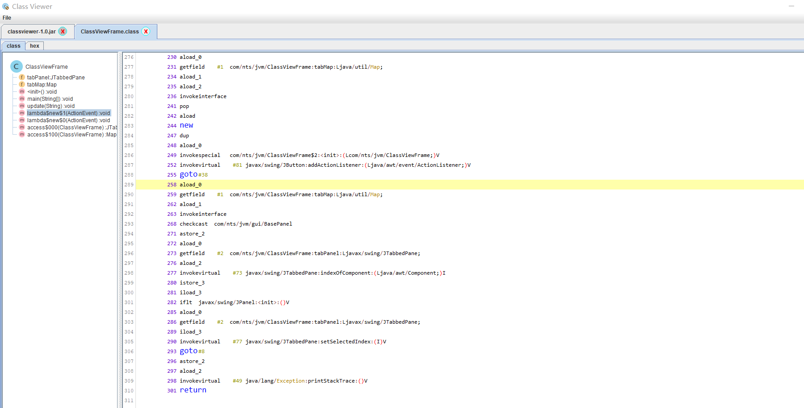

# java-classViewer

# 前言
五年前，想研究jvm字节码，读jvm的文档，无奈对文档理解不深入，  
而且对汇编指令不熟悉，一直没有深入进去。        
你是否和我一样的困扰，是否觉得字节码难以理解，      
本软件将揭开字节码神秘的面纱，对各个字段用图形化的方式，表示出来。

## 1.显示java class 文件，显示字节码

## 2.使用

打开class文件，或者把class文件拖到软件里面

## 3.查看类图

## 4. 查看字节码二进制文件内容

## 5. 查看jar文件内容

## 6.参考文档

https://docs.oracle.com/javase/specs/jvms/se16/html/jvms-6.html

## 联系我们

